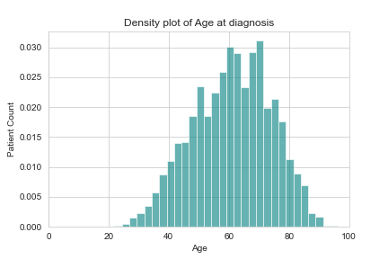
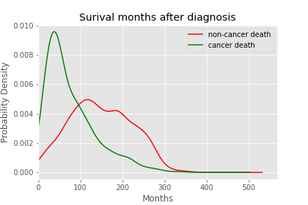
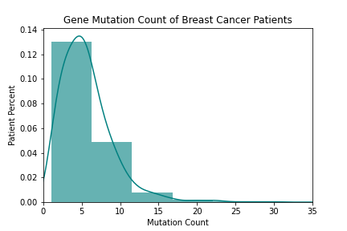
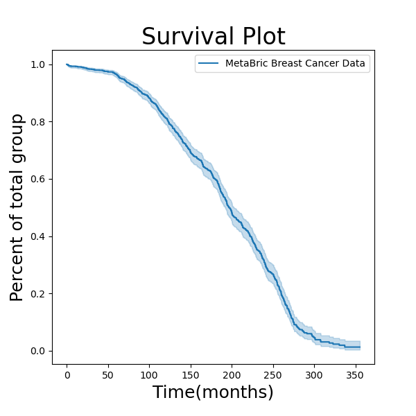

# capstone2
capstone2

## Introduction:
 The development of gene microarray technologies has allowed the detection of gene expression amoung thousands of genes simultanously. This technology can now be utilitzed to help understand the underlying pathways and outcomes of various disease states.

Beast cancer has previously been classifed based on tumor type (ductal, lobular infiltrating carcinoa, etc), HER2 receptor status, histological grade and others.  Recenlty, with cheaper, faster, and more abundant sequencing technology, the possibility of gene expression profiling (GEP) has loomed as a possible diagnostic tool.  With the complex nature of biological pathways, machine learning and big data could be the tool to elucidate the obscure pathways that have not been discovered.

*migration to electronic health records
*cheaper/faster sequencing
*in silica solutions faster and more effective that laboratory processing
*could save costs of treatment if high risk individuals are identified early and a proactive treament plan can be made.
*breast cancer data could provide insights into other forms of cancer

In this study we will be trying to find underlying features in 

## Expl

The Molecular Taxonomy of Breast Cancer International Consortium (METABRIC) is an organization hosting a database  with clinical and genetic data from over 1,980 primary breast cancer samples.

