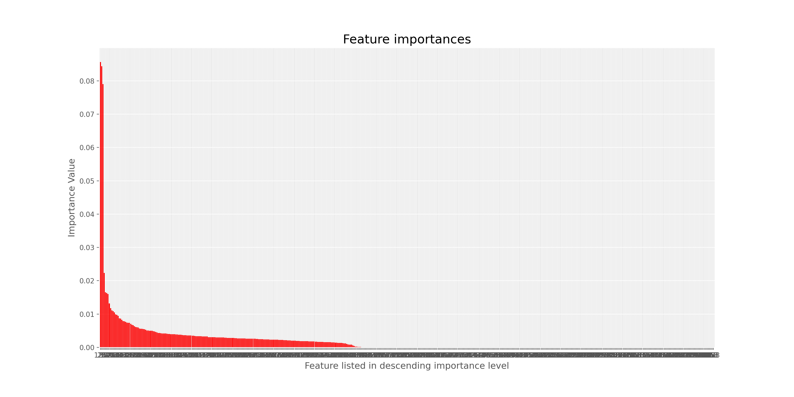

# capstone2

## Introduction:
Breast Cancer is the most common cancer maligancy in women around the world and is curable in 70-80% of patients with early detection.  In the U.S. alone, roughly 2.1 million individuals are affected.  The development of gene microarray technologies has allowed the detection of gene expression amoung thousands of genes simultanously.  Technological insights could help patient outcomes as well as save costs in non-effective treatments. This technology, in concert with the migration to electronic health records can now be utilitzed to help understand the underlying pathways of various disease states and enhance patient outcomes.

The [cBioPortal hosted by the Center of Molecular Oncology at Sloan Kettering Cancer Center](https://www.cbioportal.org/datasets) holds an open source website with various datasets.  Data from the Molecular Taxonomy of Breast Cancer International Consortium (METABRIC) was used.

<!-- Beast cancer has previously been classifed based on tumor type (ductal, lobular infiltrating carcinoa, etc), HER2 receptor status, histological grade and others.  Recenlty, with cheaper, faster, and more abundant sequencing technology, the possibility of gene expression profiling (GEP) has loomed as a possible diagnostic tool. __With the complex nature of biological pathways, machine learning and big data could be the tool to elucidate the obscure pathways that have not been discovered. -->

In this study we will be trying to find gene expression profiles in patients with poor outcomes (death by cancer) 

## Exploratory Data Analysis

The Molecular Taxonomy of Breast Cancer International Consortium (METABRIC) is an organization hosting a database  with clinical and genetic data from 1,904 primary breast cancer samples.  Genes are listed as feature columns and Z-scores of mRNA expression levels are listed as values. In this study, we will be focusing on the mRNA expression levels

Clinical information such as treatment and age at diagnosis are also features. 

Of the 1,904 patients, 622 were classfied as deceased due to cancer. and as a group had a lower time of survival after diagnosis.

Patients tend to be multi-hit events  (mutiple mutations)

Surival of all 1,904 patients

## Conclusions

* Feature 120 
Feature 120 is highest importance in 2 highest recall scoring models. Gradient Boosting and Random Forest

Based on our modeling, this gene is a strong candidate to maximize the benefit from those individuals with poor prognosis and outlooks.

Synnove et al. published in Oncology Reports an article in 2010 suggesting that AURKA could be a suitbile candidate for target therapies with tradional lab(in-situ hybridization) techniques.  [pub med article](https://pubmed.ncbi.nlm.nih.gov/20043089/#:~:text=AURKA%20gene%20amplification%20is%20a,therapies%20with%20Aurora%2DA%20inhibitors.)  

## Future Directions :

As expected, more data would help increase the prediction of the mRNA model, but also, finding a way to incorporate the clinical and gene specific mutation data to increase model accuracy/recall scores would be a potential future goal.  Potentially, using this general model to use on other disease states would be another future project.

## Acknowledgements
DSI Denver staff/cohort
Kayla Thomas
Chris Reger
Jess Curley
Ian Hettrich
Travis Koenigsknecht
Scrum Group 4 and the whole of Denver DSI

## Sources

[meta bric website](https://www.cbioportal.org/study/summary?id=brca_metabric)  

[scikit-learn](https://scikit-learn.org/)

[life-lines-install](https://lifelines.readthedocs.io/en/latest/fitters/univariate/KaplanMeierFitter.html?highlight=KaplanMeierFitter)

[wikipedia](https://en.wikipedia.org/wiki/Aurora_A_kinase)

[kaggle](https://www.kaggle.com/)

[stack_overflow](https://stackoverflow.com/)

[machine-mastert](https://machinelearningmastery.com)
[medium_banner](https://en.wikipedia.org/wiki/Aurora_A_kinase)

